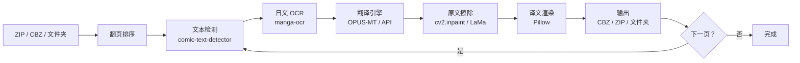

# 漫画日文→中文自动翻译覆盖工具 · 开发指南

> 本项目规划自 `zip2` 工具集的延伸需求 —— 旨在自动识别漫画中的日文文本，
> 翻译为中文，并将原文擦除后合成汉字到画面上。
> 本文档作为技术选型、架构设计与开发路线的顶层参考。

---

## 目录

1. [项目定位与目录结构](#1-项目定位与目录结构)
2. [图像处理管线架构](#2-图像处理管线架构)
3. [模块详解：文本检测](#3-模块详解文本检测)
4. [模块详解：日文 OCR](#4-模块详解日文-ocr)
5. [模块详解：翻译引擎](#5-模块详解翻译引擎)
6. [模块详解：原文擦除 (图像修复)](#6-模块详解原文擦除-图像修复)
7. [模块详解：译文渲染合成](#7-模块详解译文渲染合成)
8. [GUI 集成与输出规范](#8-gui-集成与输出规范)
9. [评测指标与开发里程碑](#9-评测指标与开发里程碑)
10. [常见问题](#10-常见问题)

---

## 1. 项目定位与目录结构

### 1.1 定位说明

本工具是一个**独立新项目**（建议命名为 `manga_translator`），与现有 `zip2/` 解耦。
仅在底层 ZIP/CBZ 读取模块上可复用 `zip_image_filter.py` 中的已有函数。

### 1.2 推荐目录树

```
manga_translator/
├── pyproject.toml           # 项目元数据 + 可选 poetry / pip 配置
├── requirements.txt         # 分层依赖（见下文）
├── README.md
├── fonts/                   # 中文字体文件（需自行下载）
│   └── NotoSansSC-Regular.ttf
├── models/                  # 模型权重（首次运行自动下载或手动放置）
│   ├── comictextdetector.pt
│   ├── manga_ocr.pt
│   └── lama.pt
├── manga_translator/
│   ├── __init__.py
│   ├── __main__.py          # CLI 入口
│   ├── pipeline.py          # 主流水线编排
│   ├── data_types.py        # 核心数据结构
│   ├── text_detection.py    # 文本区域检测
│   ├── ocr.py               # 日文 OCR
│   ├── translator.py        # 翻译引擎（统一接口）
│   ├── inpainting.py        # 图像修复（擦除原文）
│   ├── renderer.py          # 译文渲染合成
│   ├── archive.py           # ZIP/CBZ 读取与写入（可引用 zip2）
│   └── gui.py               # tkinter 图形界面
├── tests/
│   ├── test_pipeline.py
│   ├── test_ocr.py
│   └── test_renderer.py
└── scripts/
    └── download_models.py   # 一键下载所需模型权重
```

### 1.3 环境搭建

```powershell
# 推荐 Python 3.10+
python -m venv venv
.\venv\Scripts\Activate.ps1

# 基础依赖
pip install pillow opencv-python numpy

# 检测 + OCR
pip install torch torchvision
pip install ultralytics                   # YOLOv8 推理引擎（comic-text-detector 依赖）
pip install manga-ocr                     # 漫画专用日文 OCR

# 翻译（本地模型）
pip install transformers sentencepiece    # OPUS-MT ja→zh

# 或云端翻译（可选）
pip install requests

# 图像修复（进阶）
pip install lama-cleaner                  # LaMa 封装

# 打包
pip install pyinstaller

# 手动下载检测模型权重（约 80 MB），放到 models/ 目录
# Invoke-WebRequest -Uri "https://github.com/zyddnys/manga-image-translator/releases/download/beta-0.2.1/comictextdetector.pt" -OutFile "models/comictextdetector.pt"
```

### 1.4 分层依赖表

| 层级 | 用途 | 包名 | 安装体积 | 必选 |
|------|------|------|---------|------|
| **核心** | 图片解码、基础图像操作 | `pillow`, `opencv-python`, `numpy` | ~50 MB | ✅ |
| **检测** | YOLOv8 推理 | `ultralytics` | ~100 MB | ✅ |
| **OCR** | 漫画日文识别 | `manga-ocr` (含 torch) | ~800 MB | ✅ |
| **翻译-本地** | Transformers 推理 | `transformers`, `sentencepiece` | ~600 MB | 可选 |
| **翻译-云端** | 调用 HTTP API | `requests` (内置) | 0 | 可选 |
| **修复-基本** | OpenCV 快速擦除 | `opencv-python` (已含) | 0 | ✅ |
| **修复-进阶** | LaMa 深度学习修复 | `lama-cleaner` | ~400 MB | 可选 |
| **打包** | 生成独立 exe | `pyinstaller` | ~30 MB | 仅发布时 |

> **安装体积说明**：`manga-ocr` 自带 PyTorch CPU 版，约 800 MB。如果已有 GPU 版 PyTorch，
> 可安装 `manga-ocr --no-deps` 避免重复，但需自行补足缺失依赖。

### 1.5 模型权重下载

首次运行 `scripts/download_models.py`，或手动从以下来源放置：

| 模型 | 来源 | 预期路径 |
|------|------|---------|
| comic-text-detector (YOLOv8 权重) | [GitHub Release](https://github.com/zyddnys/manga-image-translator/releases/download/beta-0.2.1/comictextdetector.pt) (79.9 MB) | `models/comictextdetector.pt` |
| manga-ocr (TrOCR) | `manga_ocr` pip 包自动下载 | `~/.cache/huggingface/` |
| OPUS-MT ja→zh (`shun89/opus-mt-ja-zh`) | transformers 首次推理时自动下载 （原 `Helsinki-NLP/opus-mt-ja-zh` 已不可用，改用社区镜像） | `~/.cache/huggingface/` |
| LaMa 修复权重 | `lama-cleaner` 自动下载；或从 [manga-image-translator Release](https://github.com/zyddnys/manga-image-translator/releases/download/beta-0.2.1/inpainting.ckpt) 下载 (22.8 MB) | `models/inpainting.ckpt` |

> 所有模型合计离线约 **1.5–2 GB**。如网络受限，可在有网环境预下载后复制到目标机器。

---

## 2. 图像处理管线架构

### 2.1 完整流水线



**关键原则**：以"页"为最小处理单元，每页内串行执行 C→D→E→F→G 五个步骤；
页与页之间通过 `ProcessPoolExecutor` 并行（默认占用 80% CPU 核心）。

### 2.2 核心数据结构

贯穿各模块的数据模型，定义在 `data_types.py` 中：

```python
from dataclasses import dataclass, field
from typing import Optional
from PIL import Image
import numpy as np

@dataclass
class TextRegion:
    """一个文本区域（气泡或拟声词块）"""
    x1: int
    y1: int
    x2: int
    y2: int
    confidence: float = 0.0         # 检测置信度
    ocr_text: str = ""              # OCR 识别的日文原文
    translation: str = ""           # 中文译文
    reading_order: int = 0          # 阅读顺序（从左到右、从上到下）
    is_vertical: bool = False       # 是否为竖排文字

    @property
    def width(self) -> int:
        return self.x2 - self.x1

    @property
    def height(self) -> int:
        return self.y2 - self.y1

    @property
    def area(self) -> int:
        return self.width * self.height


@dataclass
class PageResult:
    """一页漫画的处理结果"""
    page_index: int                         # 页序号（按文件名排序后）
    original_image: Optional[Image.Image]   # 原始图（处理中引用，完成后可释放）
    repaired_image: Optional[np.ndarray]    # 擦除原文后的背景图
    final_image: Optional[Image.Image]      # 合成译文的最终图
    regions: list[TextRegion] = field(default_factory=list)
    error: Optional[str] = None


@dataclass
class PipelineConfig:
    """全局配置"""
    device: str = "cpu"                     # "cpu" 或 "cuda"
    ocr_batch_size: int = 8                 # OCR 批量推理大小
    translator_backend: str = "local"       # "local" | "deepl" | "baidu"
    translator_api_key: str = ""
    inpainting_method: str = "opencv"       # "opencv" | "lama"
    target_lang: str = "zh"                 # 目标语言代码
    font_path: str = "fonts/NotoSansSC-Regular.ttf"
    font_size_min: int = 12
    font_size_max: int = 48
    output_format: str = "cbz"              # "cbz" | "zip" | "folder"
    max_workers: int = 0                    # 0 = 自动 80% CPU
```

### 2.3 多页并行策略

```python
from concurrent.futures import ProcessPoolExecutor, as_completed

def run_pipeline(zip_path: str, config: PipelineConfig) -> list[PageResult]:
    pages = extract_pages(zip_path)        # 按文件名排序的 PIL.Image 列表
    max_workers = config.max_workers or max(1, int(os.cpu_count() * 0.8))

    results: list[PageResult] = []
    with ProcessPoolExecutor(max_workers=max_workers) as executor:
        future_map = {
            executor.submit(process_single_page, idx, img.copy(), config): idx
            for idx, img in enumerate(pages)
        }
        for future in as_completed(future_map):
            results.append(future.result())

    results.sort(key=lambda r: r.page_index)
    return results


def process_single_page(page_index: int, img: Image.Image, config: PipelineConfig) -> PageResult:
    """单个页面的完整处理（串行：检测→OCR→翻译→擦除→渲染）"""
    result = PageResult(page_index=page_index, original_image=img)

    # Step 1: 文本检测
    regions = detect_text_regions(img, config.device)
    if not regions:
        result.final_image = img
        return result

    # Step 2: OCR
    ocr_texts = ocr_batch(img, regions, config.device, config.ocr_batch_size)
    for reg, text in zip(regions, ocr_texts):
        reg.ocr_text = text

    # Step 3: 翻译（按阅读顺序排列后翻译）
    regions.sort(key=lambda r: (r.reading_order, r.y1, r.x1))
    translations = translate(
        [r.ocr_text for r in regions],
        backend=config.translator_backend,
        api_key=config.translator_api_key,
    )
    for reg, t in zip(regions, translations):
        reg.translation = t

    # Step 4: 擦除原文
    repaired = inpaint_regions(img, regions, method=config.inpainting_method)
    result.repaired_image = repaired

    # Step 5: 渲染译文
    final = render_translations(repaired, regions, config)
    result.final_image = final
    result.regions = regions
    return result
```

### 2.4 状态机（GUI 进度追踪用）

```
IDLE → SCANNING → DETECTING → OCR → TRANSLATING → INPAINTING → RENDERING → EXPORTING → DONE
                       ↑          ↓
                   CANCELED ← ANY STATE
```

每页处理时，通过 `queue.Queue` 向 GUI 线程报告当前阶段与进度百分比。

---

## 3. 模块详解：文本检测

### 3.1 技术选型

| 方案 | 优点 | 缺点 |
|------|------|------|
| **comic-text-detector** (YOLOv8) | 专为漫画训练，检测气气泡/拟声词准确率高；推理快（CPU ~0.3s/页） | 需额外下载权重文件 (~25 MB) |
| EasyOCR 内置检测 | 开箱即用，不用额外模型 | 对漫画气泡召回率明显低于专用模型 |
| DETR (端到端) | 精度最高 | 速度慢（GPU 约 0.5s/页，CPU 不可用） |

**推荐：`comic-text-detector`**

### 3.2 实现示例

```python
from ultralytics import YOLO
import numpy as np
from PIL import Image

_MODEL: YOLO | None = None

def _get_model(device: str = "cpu") -> YOLO:
    """懒加载单例模式，避免重复初始化"""
    global _MODEL
    if _MODEL is None:
        _MODEL = YOLO("models/comictextdetector.pt")
        _MODEL.to(device)
    return _MODEL


def detect_text_regions(img: Image.Image, device: str = "cpu") -> list[dict]:
    """
    返回列表，每项格式：
    {"box": [x1, y1, x2, y2], "confidence": 0.95}
    坐标相对于原图尺寸。
    """
    model = _get_model(device)
    results = model(np.array(img), conf=0.25, iou=0.5, verbose=False)
    regions = []
    if results[0].boxes is not None:
        for box in results[0].boxes:
            x1, y1, x2, y2 = map(int, box.xyxy[0].tolist())
            conf = float(box.conf[0])
            regions.append({"box": [x1, y1, x2, y2], "confidence": conf})
    return regions
```

### 3.3 关于阅读顺序

YOLO 不提供阅读顺序。推荐在后处理中按以下规则排序：

1. **按阅读方向判断**：计算所有检测框中心点的 x 坐标方差 / y 坐标方差，
   方差大的方向为阅读主方向。对于日文漫画，通常是"从上到下，从右到左"（即 y 方向方差异较大）。
2. **排序**：先按 y 轴分**列**（同一列内 x 坐标相近），每列内按 y 排序，列之间按 x 从右到左排序。

```python
def sort_regions_by_reading_order(regions: list[dict]) -> list[dict]:
    """日文漫画：从右到左，从上到下"""
    # Step 1: 计算各框中心点
    centers = []
    for r in regions:
        x1, y1, x2, y2 = r["box"]
        centers.append(((x1 + x2) / 2, (y1 + y2) / 2))

    # Step 2: 按 x 聚合成"列"（间距大于页面宽度 10% 视为不同列）
    page_w = max(c[0] for c in centers) - min(c[0] for c in centers) if centers else 1
    col_threshold = page_w * 0.1

    # 按 x 从大到小排序（右→左）
    sorted_with_centers = sorted(zip(regions, centers), key=lambda x: -x[1][0])

    # 聚合为列，每列内按 y 从小到大排序
    columns = []
    current_col = []
    last_x = None
    for reg, cx in sorted_with_centers:
        if last_x is not None and abs(cx - last_x) > col_threshold:
            current_col.sort(key=lambda x: x[1])  # y 从小到大
            columns.extend(current_col)
            current_col = [(reg, cx)]
        else:
            current_col.append((reg, cx))
        last_x = cx

    if current_col:
        current_col.sort(key=lambda x: x[1])
        columns.extend(current_col)

    return [r for r, _ in columns]
```

---

## 4. 模块详解：日文 OCR

### 4.1 技术选型

| 方案 | CER（字符错误率） | 速度 (CPU) | 备注 |
|------|------------------|-----------|------|
| **manga-ocr** | ~2–5% | ~0.3s/区域 | 专为漫画训练，对手写/印刷/变形字体均好 |
| PaddleOCR (日文) | ~5–10% | ~0.1s/区域 | 通用 OCR，对变形字体和艺术字较差 |
| Tesseract (jpn) | ~15–30% | ~0.5s/区域 | 对漫画效果很差 |

**推荐：`manga-ocr`**

### 4.2 实现示例

```python
from manga_ocr import MangaOcr
from PIL import Image
import numpy as np

_OCR: MangaOcr | None = None

def _get_ocr(device: str = "cpu") -> MangaOcr:
    global _OCR
    if _OCR is None:
        _OCR = MangaOcr(device=device)
    return _OCR


def ocr_single(img: Image.Image, region: dict, device: str = "cpu") -> str:
    """对单个文本区域执行 OCR"""
    x1, y1, x2, y2 = region["box"]
    cropped = img.crop((x1, y1, x2, y2))
    ocr = _get_ocr(device)
    return ocr(cropped)


def ocr_batch(img: Image.Image, regions: list[dict],
              device: str = "cpu", batch_size: int = 8) -> list[str]:
    """批量 OCR（manga-ocr 原生不支持 batch，此处逐区域调用并保留接口统一）"""
    results = []
    for region in regions:
        text = ocr_single(img, region, device)
        results.append(text)
    return results
```

> **注意**：`manga-ocr` 当前版本不提供原生批量推理。如果发现成为瓶颈，
> 可考虑替换为基于 TrOCR 的手动 batch 实现（将多个裁剪图拼接为 batch 张量），
> 可提升 2–3 倍吞吐量。

---

## 5. 模块详解：翻译引擎

### 5.1 方案对比

| 方案 | 质量 | 延迟 | 费用 | 离线 | 备注 |
|------|------|------|------|------|------|
| **OPUS-MT ja→zh** (HuggingFace) | ⭐⭐⭐ | ~0.5s/句 | 免费 | ✅ | 对小气泡文本有时丢失细节 |
| DeepL API (Free) | ⭐⭐⭐⭐ | ~1s/句 | 50 万字符/月免费 | ❌ | 质量最佳之一，有免费层 |
| 百度翻译 API | ⭐⭐⭐ | ~0.5s/句 | 200 万字符/月免费 | ❌ | 中文语境优化好 |
| GPT-4o-mini | ⭐⭐⭐⭐⭐ | ~1.5s/句 | 约 ¥0.15/千 token | ❌ | 质量最高，可定制风格 |

**推荐策略**：
- **默认**使用本地 `OPUS-MT`（离线、免费、零配置）
- 在 `PipelineConfig` 中提供 `translator_backend` 和 `translator_api_key` 字段，
  允许用户一键切换到 DeepL / 百度。
- 对于**拟声词**（常见于漫画），建议在翻译前置一个简单规则：
  如果是纯假名或片假名且长度 ≤ 4，保留原文并添加括号注音，而不是硬翻译。

### 5.2 统一接口设计

```python
from typing import Protocol

class Translator(Protocol):
    def translate(self, texts: list[str], **kwargs) -> list[str]:
        ...


# ── 本地 OPUS-MT ──

class LocalTranslator:
    def __init__(self, model_name: str = "shun89/opus-mt-ja-zh"):
        from transformers import MarianMTModel, MarianTokenizer
        self.tokenizer = MarianTokenizer.from_pretrained(model_name)
        self.model = MarianMTModel.from_pretrained(model_name)

    def translate(self, texts: list[str], **kwargs) -> list[str]:
        if not texts:
            return []
        batch = self.tokenizer(texts, return_tensors="pt",
                               padding=True, truncation=True, max_length=128)
        generated = self.model.generate(**batch, max_length=128)
        return [self.tokenizer.decode(t, skip_special_tokens=True) for t in generated]


# ── DeepL API ──

class DeepLTranslator:
    API_URL = "https://api-free.deepl.com/v2/translate"

    def __init__(self, api_key: str):
        self.api_key = api_key

    def translate(self, texts: list[str], **kwargs) -> list[str]:
        import requests
        params = {
            "auth_key": self.api_key,
            "text": texts,
            "source_lang": "JA",
            "target_lang": "ZH",
        }
        resp = requests.post(self.API_URL, data=params, timeout=15)
        resp.raise_for_status()
        return [r["text"] for r in resp.json()["translations"]]


# ── 工厂函数 ──

def create_translator(backend: str = "local", api_key: str = "") -> Translator:
    if backend == "deepl":
        return DeepLTranslator(api_key=api_key)
    # backend == "local" 或其他
    return LocalTranslator()
```

### 5.3 翻译约束

翻译后中文字数通常为日文的 60–80%，但仍可能出现译文过长。
建议在渲染模块中**自适应缩小字号**，而不是裁剪译文。

---

## 6. 模块详解：原文擦除（图像修复）

### 6.1 方案对比

| 方案 | 质量 | 速度 (CPU) | 适用场景 |
|------|------|-----------|---------|
| **cv2.inpaint (Telea)** | ⭐⭐ | ~0.05s/区域 | 纯色/浅色气泡背景 |
| **cv2.inpaint (NS)** | ⭐⭐ | ~0.05s/区域 | 同上，纹理稍好 |
| **LaMa** (深度学习) | ⭐⭐⭐⭐⭐ | ~1–2s/页 | 复杂背景、线条重叠、拟声词 |

**推荐策略**：
- 默认使用 `cv2.inpaint`（零额外依赖，极快）
- 在配置中提供 `inpainting_method: "opencv" | "lama"` 切换
- 可智能判断：如果检测到区域与周围颜色方差 > 阈值（即背景复杂），自动升级到 LaMa

### 6.2 实现示例

```python
import cv2
import numpy as np
from PIL import Image


def inpaint_regions(img: Image.Image, regions: list[dict],
                    method: str = "opencv") -> np.ndarray:
    """
    擦除所有文本区域，返回修复后的 numpy array (RGB)。
    """
    cv_img = cv2.cvtColor(np.array(img), cv2.COLOR_RGB2BGR)
    mask = np.zeros(cv_img.shape[:2], dtype=np.uint8)

    for region in regions:
        x1, y1, x2, y2 = region["box"]
        # 适当扩展区域（+2px）确保完全擦除
        cv2.rectangle(mask, (max(0, x1-2), max(0, y1-2)),
                      (cv_img.shape[1]-1, y2+2), 255, -1)

    if method == "lama":
        return _inpaint_lama(cv_img, mask)
    else:
        # OpenCV 快速修复
        result = cv2.inpaint(cv_img, mask, inpaintRadius=3,
                             flags=cv2.INPAINT_TELEA)
        return cv2.cvtColor(result, cv2.COLOR_BGR2RGB)


def _inpaint_lama(img_bgr: np.ndarray, mask: np.ndarray) -> np.ndarray:
    """
    使用 LaMa 模型修复（需要 lama-cleaner 包）。
    可参考 https://github.com/Sanster/lama-cleaner
    """
    try:
        from lama_cleaner.model_manager import ModelManager
        from lama_cleaner.schema import Config as LamaConfig
        model = ModelManager(name="lama", device="cpu")
        cfg = LamaConfig(
            ldim=8,
            hr=False,
            wd=None,
            sd_mask_mode="keep",
        )
        # lama_cleaner 的接口较为复杂，此处为示意
        # 实际使用时建议参考其官方 API
        result = model(img_bgr, mask, cfg)
        return cv2.cvtColor(result, cv2.COLOR_BGR2RGB)
    except ImportError:
        # 降级到 OpenCV
        result = cv2.inpaint(img_bgr, mask, inpaintRadius=3,
                             flags=cv2.INPAINT_TELEA)
        return cv2.cvtColor(result, cv2.COLOR_BGR2RGB)
```

---

## 7. 模块详解：译文渲染合成

### 7.1 字体选型

| 字体 | 优点 | 缺点 |
|------|------|------|
| **Noto Sans CJK SC** (思源黑体) | 开源、无版权、涵盖汉字全字符集 | 文件 ~15 MB |
| Microsoft YaHei (微软雅黑) | Windows 预装 | 只含常用汉字，美术字偏少 |
| Source Han Serif SC (思源宋体) | 宋体更接近漫画印刷感 | 更细，小字号可读性略差 |

**推荐：Noto Sans CJK SC Regular**。从 [Google Fonts](https://fonts.google.com/noto) 下载后放入 `fonts/` 目录。

### 7.2 字号自适应算法

核心需求：在气泡区域内，以最大可能的字号完整显示译文。

```python
from PIL import Image, ImageDraw, ImageFont
import textwrap


def render_text(draw: ImageDraw, region_bounds: tuple,
                text: str, font_path: str, is_vertical: bool = False):
    """
    在区域内渲染文本，自动计算最佳字号并居中。
    返回 True 表示渲染成功，False 表示字号太小无法渲染。
    """
    x1, y1, x2, y2 = region_bounds
    target_w = x2 - x1
    target_h = y2 - y1

    # 从最大字号向下搜索
    for font_size in range(48, 7, -1):
        font = ImageFont.truetype(font_path, font_size)

        if is_vertical:
            # 竖排：每列一个字，column 数 = 字数
            lines = list(text)  # 每个字符一列
            line_height = font_size * 1.2
            total_w = len(lines) * line_height
            total_h = font_size * 1.2
            if total_w <= target_w and total_h <= target_h:
                break
        else:
            # 自动换行：先按一行能容纳的字数估算
            char_w = font.getbbox("测")[2]  # 汉字近似宽度
            max_chars_per_line = max(1, target_w // char_w)
            lines = textwrap.wrap(text, width=max_chars_per_line)
            line_height = font_size * 1.4
            if line_height * len(lines) <= target_h:
                break

    # 如果到 8px 都不行，放弃渲染
    if font_size < 8:
        return False

    # 居中绘制
    if is_vertical:
        # 竖排：从右到左
        for i, ch in enumerate(text):
            cx = x1 + i * int(font_size * 1.2) + int(font_size * 0.2)
            cy = y1 + int((target_h - font_size) / 2)
            draw.text((cx, cy), ch, font=font, fill=(0, 0, 0))
    else:
        total_text_h = len(lines) * int(font_size * 1.4)
        y_offset = y1 + (target_h - total_text_h) // 2
        for line in lines:
            # 水平居中
            line_w = draw.textbbox((0, 0), line, font=font)[2]
            x_offset = x1 + (target_w - line_w) // 2
            draw.text((x_offset, y_offset), line, font=font, fill=(0, 0, 0))
            y_offset += int(font_size * 1.4)

    return True
```

### 7.3 横排 / 竖排判断

日文漫画中，文字方向由气泡形状决定：

```python
def decide_orientation(region: dict) -> bool:
    """返回 True 表示竖排 (vertical)"""
    w = region["box"][2] - region["box"][0]
    h = region["box"][3] - region["box"][1]
    # 如果高度 > 宽度 × 1.2，认为是竖排气泡
    return h > w * 1.2
```

### 7.4 完整合成函数

```python
def render_translations(repaired: np.ndarray,
                        regions: list[TextRegion],
                        config: PipelineConfig) -> Image.Image:
    """在修复后的图像上渲染所有译文"""
    img = Image.fromarray(repaired)
    draw = ImageDraw.Draw(img)

    for reg in regions:
        if not reg.translation.strip():
            continue
        is_vert = decide_orientation(reg)
        render_text(
            draw, (reg.x1, reg.y1, reg.x2, reg.y2),
            reg.translation, config.font_path, is_vertical=is_vert,
        )

    return img
```

---

## 8. GUI 集成与输出规范

### 8.1 与 `zip2` 的复用点

从现有 `zip_image_filter.py` 可复用的函数：

| 函数 | 位置 | 用途 |
|------|------|------|
| `count_images_in_zip(zip_path)` | `zip_image_filter.py:50` | 快速统计 ZIP 内图片数 |
| 图片扩展名集合 `IMAGE_EXTS` | `zip_image_filter.py:42` | 过滤非图片文件 |
| `ZipFile.namelist()` + `Path(x).suffix` | 同上 | 遍历 ZIP 内文件 |
| 高 DPI 自适应代码 | `zip_image_filter.py:9-20` | tkinter 窗口缩放 |

建议直接 `import zip_image_filter` 并调用 `count_images_in_zip`，不必重复实现。

### 8.2 GUI 布局草稿

```
┌─────────────────────────────────────────────────┐
│ 📖 漫画翻译工具                   设置 ⚙️       │
├─────────────────────────────────────────────────┤
│ 📂 输入: [选择文件] [选择文件夹]                 │
│    [x] 包含子目录      已选: 0 个文件           │
├─────────────────────────────────────────────────┤
│ 翻译设置: [目标语言: 中文 ▼]                    │
│ 翻译引擎: [● 本地模型  ○ DeepL API]             │
│ 修复方式: [● OpenCV  ○ LaMa (高质量)]           │
│ 输出格式: [CBZ ▼]   输出目录: ...               │
├─────────────────────────────────────────────────┤
│ [▶ 开始翻译]  [⏹ 停止]                        │
│ 进度: ████████░░░░ 68%                          │
│ 当前: 翻译中... (第 12/45 页)                   │
├──────────────────┬──────────────────────────────┤
│ 原图              │ 译后图                       │
│ ┌──────────────┐  │ ┌──────────────┐             │
│ │              │  │ │              │             │
│ │ (缩略图)     │  │ │ (缩略图)     │             │
│ │              │  │ │              │             │
│ └──────────────┘  │ └──────────────┘             │
│ 第 12/45 页       │                              │
│ [◀] [▶]          │                              │
├──────────────────┴──────────────────────────────┤
│ 文本修正面板:                                    │
│ [原文] コマンドを実行する                        │
│ [译文] 执行命令                      [保存修正]  │
└─────────────────────────────────────────────────┘
```

### 8.3 输出格式规范

| 格式 | 规范 | 示例 |
|------|------|------|
| **CBZ** | 标准 ZIP 文件（扩展名 `.cbz`），内页按文件名排序，推荐 `001.jpg`, `002.jpg`... | `manga_chapter1.cbz` |
| **ZIP** | 同名输入文件 + `_translated` 后缀，保持原目录结构 | `my_comic_translated.zip` |
| **文件夹** | 直接在指定输出目录下生成排序后的图片 | `./output/page001.png` |

**建议默认使用 CBZ 格式**，与主流漫画阅读器（如 Tachiyomi、Kindle Comic Converter）兼容。

### 8.4 CBZ 写入示例

```python
import zipfile
from pathlib import Path

def export_as_cbz(pages: list[PageResult], output_path: str):
    """输出为 CBZ 格式"""
    with zipfile.ZipFile(output_path, 'w', zipfile.ZIP_DEFLATED) as zf:
        for i, page in enumerate(pages, 1):
            if page.final_image is None:
                continue
            buf = io.BytesIO()
            page.final_image.save(buf, format='PNG')
            zf.writestr(f"{i:03d}.png", buf.getvalue())
```

---

## 9. 评测指标与开发里程碑

### 9.1 质量评测指标

| 指标 | 方法 | 目标值 |
|------|------|--------|
| **OCR 字符正确率 (CER)** | 对 100 页漫画标注，对比 OCR 结果与人工转录 | < 5% |
| **翻译可读性** | 人工评分 1–5（语法通顺、上下文一致） | 平均 ≥ 3.5 |
| **修复 PSNR** | 对比擦除前原图（已知无文字区域）与修复图 | ≥ 35 dB |
| **修复 SSIM** | 同上 | ≥ 0.95 |
| **渲染溢出不超标** | 渲染后文本超出气泡比例 | < 5% 的区域 |
| **端到端速度** | CPU 环境下每页处理时间 | < 10s/页 |

### 9.2 开发里程碑

```
P0 — MVP（单页可用）
 ├── 读取单张图片
 ├── 文本检测 + OCR 输出原文
 ├── 手动复制原文到外部翻译 → 粘贴译文回程序
 └── cv2.inpaint 擦除 + Pillow 渲染合成

P1 — 全自动批量流水线
 ├── 本地 OPUS-MT 翻译集成
 ├── ZIP/CBZ 批量输入输出
 ├── 多页并行处理
 └── 完整 CLI 命令行

P2 — GUI 桌面应用
 ├── tkinter 全功能界面（文件选择、进度、对比预览）
 ├── DeepL API 切换支持
 ├── 设置记忆（config.json）
 └── pyinstaller 单文件 exe 发布

P3 — 质量提升
 ├── LaMa 修复集成 + 智能切换
 ├── 拟声词特殊处理（保留+注音）
 ├── 手动修正面板（修改 OCR / 翻译后重新合成）
 ├── 翻译风格选择（口语化/书面语）
 └── 翻译上下文保持（跨页角色名一致）
```

### 9.3 预估时间线

| 里程碑 | 单人开发预估 | 关键依赖 |
|--------|------------|---------|
| P0 | 1 周 | 模型下载、检测 + OCR 运行成功 |
| P1 | 1–2 周 | 翻译模型加载、流水线调试 |
| P2 | 1–2 周 | tkinter 界面开发 |
| P3 | 2–3 周 | LaMa 集成、拟声词处理、用户反馈迭代 |
| **合计** | **5–8 周** | |

---

## 10. 常见问题

### Q1: 没有 GPU，能跑吗？
**能。** 所有模型均支持 CPU 推理。manga-ocr 和 YOLO 在 CPU 上单页约 0.3–0.5 秒，LaMa 约 1–2 秒。
多页并行下整体吞吐约 **2–5 页/分钟**（8 核 CPU）。

### Q2: 模型下载太慢 / 无法访问 HuggingFace？
- 使用镜像站：`export HF_ENDPOINT=https://hf-mirror.com`
- 或者在有网环境预下载：将 `~/.cache/huggingface/` 整个目录复制到目标机器
- 漫画文本检测模型权重已托管在 HuggingFace，也可从 [GitHub Release](https://github.com/dmMaze/comic-text-detector/releases) 手动下载

### Q3: 遇到超大 ZIP（>500 MB）怎么办？
- 默认流式处理：逐页解压到临时目录，处理完立即释放
- 在 `PipelineConfig` 中增加 `max_pages` 和 `memory_limit_mb` 限制
- 如果内存仍不足，单进程顺序处理（`max_workers=1`）

### Q4: 翻译后中文超出气泡边界？
- 方案一：自动缩小字号（已内置）
- 方案二：对超长译文进行智能截断（保留句末标点）
- 方案三：在翻译 prompt 中附加"在 150px 宽区域内显示，请用简洁中文"（仅 DeepL/GPT 支持）

### Q5: 竖排文字检测失败？
- comic-text-detector 对竖排气泡检测效果良好，但个别极端旋转（>30°）可能漏检
- 可在检测后增加规则：检测框内像素亮度方差分析，判断是否有文字存在

### Q6: OCR 结果包含标点符号和空格？
- manga-ocr 的输出通常较干净。如有噪音，可在 post-processing 中过滤：
  ```python
  import re
  cleaned = re.sub(r'[\s\u3000]+', '', text)  # 去除日文空格
  ```

---

> **文档版本**: v1.0 · 最后更新: 2025-01
> **维护者**: zip2 项目团队
> **参考资源**:
> - [comic-text-detector](https://github.com/dmMaze/comic-text-detector)
> - [manga-ocr](https://github.com/kha-white/manga-ocr)
> - [OPUS-MT (shun89/opus-mt-ja-zh)](https://huggingface.co/shun89/opus-mt-ja-zh) — 原 `Helsinki-NLP/opus-mt-ja-zh` 已下线，改用此社区镜像
> - [LaMa](https://github.com/advimman/lama)
> - [lama-cleaner](https://github.com/Sanster/lama-cleaner)
